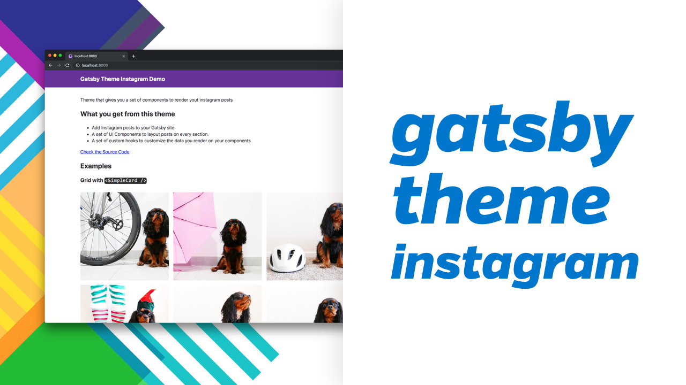

#  Theme Instagram Workspace

This is a Yarn workspace for the Instagram theme `gatsby-theme-instagram`.

## TODO

- [ ] make components more accessible
- [ ] improve design
- [ ] try to pass a config to a static query
- [ ] better responsive styling

---

<!-- ALL-CONTRIBUTORS-LIST:START - Do not remove or modify this section -->
<!-- prettier-ignore -->
<table>
  <tr>
    <td align="center"><a href="http://horacioh.com"> <b>Horacio Herrera</b></a> <a href="https://github.com/horacioh/gatsby-theme-instagram/commits?author=horacioh" title="Documentation">📖</a> <a href="https://github.com/horacioh/gatsby-theme-instagram/commits?author=horacioh" title="Code">💻</a> <a href="#design-horacioh" title="Design">🎨</a> <a href="#example-horacioh" title="Examples">💡</a> <a href="#video-horacioh" title="Videos">📹</a> <a href="#tutorial-horacioh" title="Tutorials">✅</a> <a href="#review-horacioh" title="Reviewed Pull Requests">👀</a></td>
    <td align="center"><a href="https://github.com/laradevitt"> <b>laradevitt</b></a> <a href="https://github.com/horacioh/gatsby-theme-instagram/commits?author=laradevitt" title="Documentation">📖</a></td>
  </tr>
</table>

<!-- ALL-CONTRIBUTORS-LIST:END -->

This project follows the [all-contributors](https://github.com/all-contributors/all-contributors) specification. Contributions of any kind welcome!
